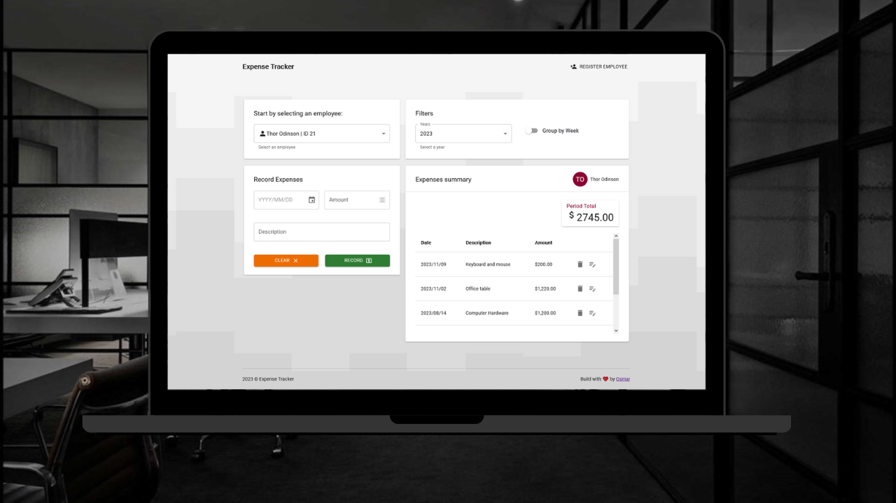

 
#  Expense Tracker

This app is a practical tool for managing expenses, designed with Next.js and Material-UI. Allow user registration and expenses management.

> Check the deployed [app](https://expense-tracker-osm.vercel.app/).

💭 Features:\
\
- Retrieve years with recorded expenses and populate a dropdown list for each employee. \
- Enable filtering by year and grouping expenses by week. \

## 📋 Instalation guide

- Clone this repo;
- On the root folder execute `npm run dev`;
- Check the applicaton running on `http://localhost:3000/`

## 💻 Tech stack

     

## 🔗 Links

- App backend [repo](https://github.com/osmfaria/expense-tracker-backend);
- API [documentation](https://osm-expense-tracker-f0320512353f.herokuapp.com/api-docs/) 
